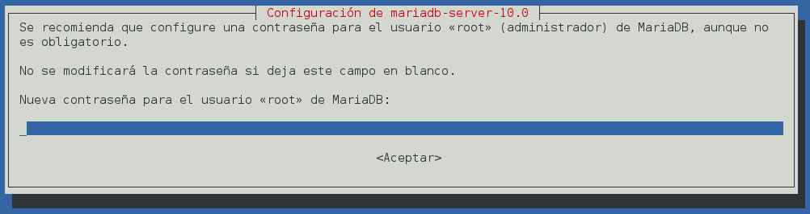
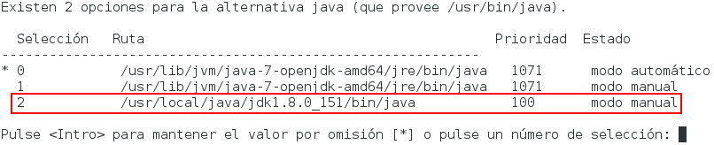
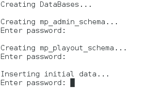
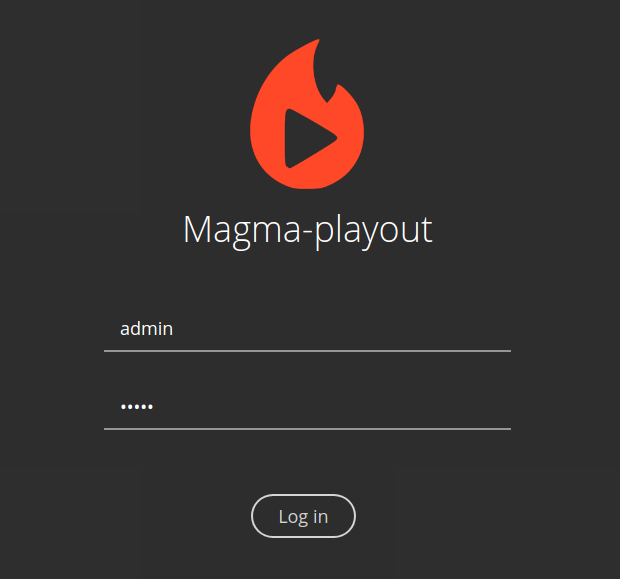
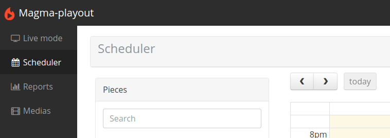

# Manual de Instalación

Este documento detalla los pasos necesarios para poder instalar el sistema _Magma Playout_.

## Requerimientos 

Antes de comenzar la instalación de _Magma Playout_ se debe contar con 
una computadora con las siguientes características mínimas:  
  * Procesador de 2 núcleos de 2.6 GHz
  * 4 Gb de memoria RAM
  * 50 Gb de almacenamiento (influye directamente en la cantidad de medios disponibles para reproducir)
  * Sistema operativo Debian 9  
  * Conexión a internet activa


## Instalación

El proceso de instalación de _Magma Playout_ se realiza en su totalidad desde
una terminal y tarda aproximadamente 45 minutos en completar, aunque depende de las velocidades del procesador y de la conexión a internet.  
A continuación se describen los pasos para instalar el sistema.  

### Instalar el comando _sudo_ 

Abrir una terminal y ejecutar lo comandos descritos a continuación.  
Tener en cuenta que tienen que ser modificados según el ambiente en el que se va a instalar.  

```bash
su  
apt-get -y install sudo  
# En el siguiente comando reemplazar <username> con el
# nombre del usuario de Debian que se está utilizando
usermod -aG sudo <username>  
# La computadora se va a reiniciar
reboot
``` 

### Descargar e instalar Magma Playout

Abrir una terminal y ejecutar lo comandos descritos a continuación.  

```bash
cd
sudo apt-get -y install git
git clone https://github.com/MagmaPlayout/mp-installer.git
cd mp-installer
./install.sh
```

Durante la instalación se requiere la interacción del usuario para las siguientes acciones:
1. Ingresar la contraseña del usuario.
1. Ingresar una contraseña para el servidor base de datos mariadb-server cuando se presente la siguiente pantalla:  
<p align="left">
	
</p>  

NOTA: Dependiendo de la versión que tengan los repositorios de Debian, esta pantalla puede no aparecer. De no aparecer referirse a la sección _Configuración de la Base de Datos_.

3. Seleccionar la instalación de java cuyo path sea "/usr/local/java/jdk1.8.0_151/java".
<p align="left">
	
</p>

4. Ingresar la contraseña de la base de datos al momento de generar los esquemas (la misma que se definió en el paso 2):
<p align="left">
	
</p>


## Configuración de la Base de Datos

Se deben ejecutar los siguientes comandos desde una terminal si durante la instalación del sistema no se pidió al usuario la configuración de la contraseña de _root_ para _MariaDB_ :  
```bash
sudo mysql -u root 
use mysql;
update user set plugin='' where User='root';
flush privileges;
quit;
mysql_secure_installation # Seguir los pasos propuestos por este wizard
```  
Una vez terminada la configuración se puede volver a ejecutar el script ```mp-installer/database/01-createDbs.sh```


## Configuración

El sistema cuenta con los siguientes archivos de configuración:
1. ```~/.magma-playout.conf```
1. ```~/mp-installer/magma-playout/core/mp-core-api/config.js```
1. ```~/mp-installer/magma-playout/store/mp-admin-api/config.js```
1. ```~/mp-installer/magma-playout/store/mp-playout-api/config.js```

Los archivos de configuración se cargan con datos por defecto válidos, por lo que no es necesario cambiarlos si se desea utilizar la configuración provista.  
A continuación se describen las claves del archivo de configuración principal:  

### ~/.magma-playout.conf
```bash
# ------------------------------- #
# Core config ------------------- #
# ------------------------------- #

# Duración en minutos a mantener en la lista de melted
melted_playlist_max_duration=120 
# Frecuencia de trabajo del thread que vigila el tiempo restante 
# de la lista de melted
melted_appender_worker_freq=5
# Directorio a la instalación de melt
melt_path=/<installation>/core/melted/installation/bin/melt
# Directorio al media por defecto. Debe ser un directorio válido a una imágen.
default_media_path=/<installation>/../dependencies/default.png
# Directorio temporal donde se van a poner los archivos .mlt 
# "espaciadores" con el media por defecto
mlt_spacers_path=/<installation>/media/spacers/

# ------------------------------- #
# mp-devourer config ------------ #
# ------------------------------- #

# FPS al cual se van a transcodear todos los medias cargados
medias_fps=60
# Directorio de entrada del cual cargar los medias al sistema
devourer_input_dir=/installation/media/input
# Directorio de salida donde se guardan los medias transcodeados
devourer_output_dir=/<installation>/media/output
# Directorio de thumbnails del frontend
devourer_thumb_dir=/<installation>/gui/mp-ui-playout/src/assets/images/media-thumbnails/
# Directorio de la instalación del MLT Framework
mlt_framework_dir=/<installation>/core/melted/installation/bin/
# Argumentos de transcodificación
devourer_ffmpeg_args= -f avi -c:v libx264 -qp 0
```

### Configuración de la salida audiovisual

El archivo _mp-installer/magma-playout/core/melted/installation/etc/melted.conf_ tiene la configuración de la instancia de _melted_ que usa _Magma Playout_.  

Como salida por defecto tiene configurada la ventana de previsualización:  
> uadd sdl

Para configurar la salida a una placa **blackmagic** se debe reemplazar la línea ```uadd sdl``` por ```uadd decklink:0``` donde el _:0_ indica el número de la placa.

## Ejecución

Para probar la instalación realizar los siguientes pasos:
1. ejecutar el script ```mp-installer/run.sh```  
Se deberá ver una ventana con el preview de la reproducción mostrando la imágen de Maga Playout.  


<p align="center">
	
</p>


2. Abrir el navegador Google Chrome y acceder a la URL _https://-servidor-:4200/_ donde _"-servidor-"_ es la IP o dominio del servidor sobre el cual se ejecutó la instalación de _Magma Playout_  
Se deberá ver la pantalla de login de la aplicación.  

<p align="center">
	
</p>	


3. Para acceder al sistema se deben usar las credenciales cargadas por defecto: usuario admin, password admin.  
Se deberá ver la pantalla principal del sistema sin medias cargados.

<p align="center">
	
</p>


