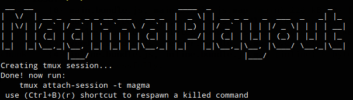

<h1 align="center"><p>Magma Playout</p>
<p>Manual de usuario</p></h1>

El sistema _"Magma Playout"_ permite administrar la programación de medios audiovisuales que serán transmitidos por algún medio de difusión soportado por la herramiente _"Melted"_.  

Para acceder al sistema se necesita el navegador web _"Google Chrome"_ y la URL de la instalación.

## Ejecución del sistema

Acceder al directorio de instalación del sistema y ejecutar desde una terminal el script ```run.sh```.  
Al finalizar su ejecución se mostrará el siguiente mensaje:  
<p align="left">
	
</p>  

Para acceder a las terminales específicas de cada proceso, se debe ejecutar el comando ```tmux attach-session -t magma```.  


## Inicio de sesión

​Al acceder a la URL del sistema (por defecto _http://localhost:4200_) se pide un usuario y contraseña.
Si el sistema está recién instalado se puede acceder con el usuario ​_admin_ y contraseñ​a _admin_​ .  
​Referirse a la sección _Administración de usuarios_ para cambiar la contraseña inicial.​

Una vez autenticado en el sistema se puede ver la pantalla principal:  
**TODO: IMG**

### Panel de menú

Desde el panel de menú se puede navegar a las distintas pantallas del sistema.  
**TODO: IMG**

### Sección principal

La sección principal muestra las operaciones que se pueden realizar en la pantalla actual.

**TODO: IMG**

### Barra superior

La barra superior permite cerrar la sesión autenticada para el usuario actual.

**TODO: IMG**

## Administración de usuarios

La administración de usuarios está ubicada en la pantalla _"Admin"_ accesible mediante el _"Panel de menú"_

### Creación de usuario

Para crear un usuario se deben seguir los siguientes pasos, desde la pantalla _"Admin"_:

1. Hacer click en el botón de agregar.
1. Completar los campos _Name_, _Surname_.
1. Seleccionar el rol del usuario:
    - Super: Rol de tipo administrador, tiene acceso a todas las pantallas del sistema.
    - Programmer: Operador del playout. Tiene acceso a las pantallas _"Scheduler"_ y _"Live mode"_.
    - Reports: Este rol permite acceder únicamente a la pantalla _"Reports"_ para exportar reportes de reproducción.
    - Media: Este rol permite acceder únicamente a la pantalla _"Medias"_ donde se pueden administrar los medias con filtros y los metadatos de los medias cargados en el sistema.
1. Completar los campos _Username_ y _Password_ que determinan las credenciales de acceso al sistema.

## Baja de usuario

Para dar de baja un usuario se deben seguir los siguientes pasos, desde la pantalla _"Admin"_:

1. Identificar el usuario que se desea dar de baja en la grilla de usuarios.
1. Hacer click en el botón de eliminar ubicado a la derecha de la fila del usuario.

## Modificación de rol

Para cambiar el rol de un usuario se deben seguir los siguientes pasos, desde la pantalla _"Admin"_:

1. Identificar el usuario que se desea modificar en la grilla de usuarios.
1. Hacer click en el selector de la columna _Role_ correspondiente al usuario a modificar.
1. Seleccionar el nuevo rol para el usuario.

## Administración de medias

Para cargar medias en el sistema se debe utilizar la herramienta **mp-devourer** desde una terminal conectada al servidor donde se ejecuta _Melted_.

1. Copiar los medias a utilizar al directorio _"inputDir_" definido en el archivo de configuración _"~/.magma-playout.conf"_ del usuario con el que se ejecuta el sistema.
1. Ejecutar el comando _./mp-devourer.sh_ ubicado en el directorio raíz de la instalación del sistema.
1. Desde la interfaz web, abrir la pesta


### Creación de filtros


### Edición de datos

## Modo _"En Vivo"_

## Modo _"Programador"_

## Previsualización de medias

Para previsualizar medias se debe estar en la pantalla de _Modo en vivo_ o _Modo programador_ y posicionar el puntero del mouse sobre el media que se desea previsualizar.  
La imagen que identifica al media empezará a cambiar mostrando distintas imágenes correspondientes al media.  
Estas imágenes se generan al importar los medias en el sistema utilizando el _mp-devourer_.

## Reportes

### Exportación a CSV

Para exportar un reporte a _csv_ se debe hacer click sobre el botón _"Export"_.   
El navegador comenzará a bajar un archivo de tipo _.csv_ con los contenidos del reporte generado desde el sistema.